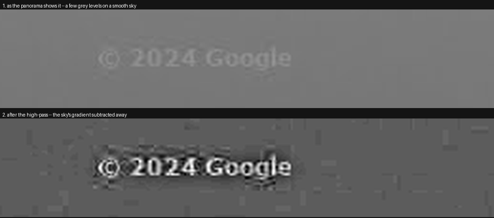
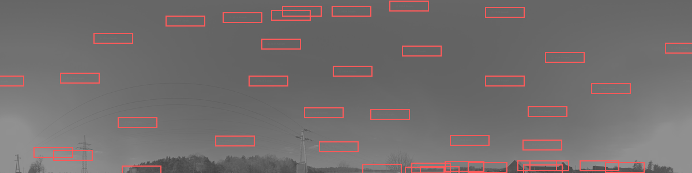
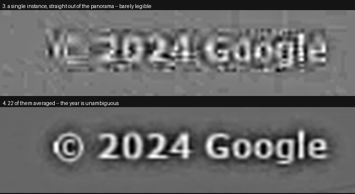

# CR Labeler

Reads the **copyright year printed into Google Street View imagery** and tags locations with it.

> ### About this project
> **The code in this repository was written by an AI** (Claude), working from a brief and iterating
> against measurements. **The ground truth was labelled by a human** — 543 panoramas read by eye,
> plus the original 20-panorama seed set. That division matters when reading the accuracy numbers
> below: the program was tuned by its author, but it was *scored* against labels it never saw.

---

## What it does

Every Street View panorama carries a faint `© YYYY Google` stamp burned into the imagery. That year
is **not** the capture date — it is when Google last processed the imagery. A panorama photographed
in 2012 can carry a 2026 copyright. No API exposes it. The only source of truth is the pixels.

```bash
cr-label label labeling/my-map.json
```

Input and output are [map-making.app](https://map-making.app/) / GeoGuessr map JSON. Each location
gains one tag — `CR_2024`, `CR_None` (no watermark), or `CR_unknown` (found one, couldn't read it) —
and everything else in the file is preserved untouched.

## Results

Measured against 543 hand-labelled panoramas the program never saw during development:

| | Unbiased sample (n=203) | Whole labelled set (n=543) |
|---|---|---|
| Precision — of the answers it gives | **100.0%** | **99.4%** |
| Coverage — how often it answers at all | **100.0%** | 99.8% |
| **Wrong years** | **0** | **0** |

Of 455 year answers, **all 455 were exactly right**. Every year from 2009 to 2026 scored 100%.

Most of the labelled set was chosen deliberately to be hard, so the unbiased column is the one that
describes normal use. The three errors across the whole set are all at the *has a watermark / has
none* boundary, never a wrong year.

---

## How it works

There is **no neural network and nothing is trained.** The watermark is a fixed, machine-rendered
piece of text, so this is a signal-processing problem rather than a learning one.

### The problem

A single stamp is only a few grey levels above the noise. Here is one, at real brightness:



The top strip is the panorama as it comes. The bottom is the same pixels after subtracting a blurred
copy of themselves — a **high-pass filter**. The sky's smooth gradient disappears; the thin strokes
of the text survive, because they are the only sharp thing there.

### Step 1 — find every copy

The stamp is not printed once. It is scattered across the whole panorama, dozens of times, and about
96% of them land in the upper half:



Each red box is one detection. They are found by **matched filtering** — sliding a picture of the
`Google` wordmark across the image and looking for peaks. The wordmark is used rather than the whole
string because it is the part that never changes, whatever the year.

### Step 2 — throw out the false ones

Matched filtering finds every real stamp but also fires on tree branches and JPEG noise. The filter
is left deliberately permissive, and the false hits are removed afterwards by **consensus**:

> Every real stamp is *the same bitmap*, so they all look like one another.
> A false hit looks like nothing else in the set.

Keeping only the largest mutually-agreeing group discards the contamination without needing a
delicately tuned threshold. On a panorama with no watermark at all no such group forms — which is
exactly the answer wanted there.

### Step 3 — average them

This is what makes the whole thing work:



Averaging N aligned copies suppresses noise by roughly √N while the watermark, identical in every
copy, reinforces. One instance is barely legible. Twenty-two of them are unambiguous.

### Step 4 — read the year

The averaged image is compared against a **bank of reference images** — real averaged watermarks, one
per (rendering, year). Each of the four digit positions is scored in its own slot, so every digit
counts equally, and the answer is the year that matches best.

Then three checks decide whether to trust it, because **declining to answer beats answering wrongly**:

| Check | Rejects |
|---|---|
| Does this look like a watermark at all? | panoramas with none → `CR_None` |
| Does *every* digit match, not just on average? | years the bank has never seen |
| Does the winner beat the runner-up? | genuine ties |

If a reading is weak it escalates, each step kept only if it scores better than what came before:
zoom 3, then the full sphere, then zoom 4 — which covers four times the area at the same glyph size
and typically triples the number of instances found. "Weak" includes two readings that *look*
answered: one built from a single instance (nothing agreed with it, so consensus never checked it)
and one whose winning year barely beat the runner-up.

### Why a bank of real images, and not rendered text

Synthetic text in the same font scores **10/20** against ground truth. Google's rasterisation has a
halo and sub-pixel placement that a font render does not reproduce. The same classifier using real
averaged composites scores **20/20**. Synthetic text is used once, only to bootstrap a bank from
nothing — it is good enough to *find* the stamps, and the data takes over from there.

---

## Install

**These instructions assume [conda](https://docs.conda.io/projects/conda/en/stable/) is installed**
— either [Miniconda](https://www.anaconda.com/docs/getting-started/miniconda/install) (just the
package manager) or Anaconda. Check with `conda --version`; if that fails, install Miniconda first.
Conda is how this was developed and what the commands below are written for.

```bash
conda create -n cr_labeler python=3.12 numpy pillow requests tqdm pytest
conda activate cr_labeler
pip install -e .
```

Nothing here actually *requires* conda — the dependencies are ordinary PyPI packages, so any Python
3.10+ environment works. With `venv` instead:

```bash
python3 -m venv .venv && source .venv/bin/activate    # Windows: .venv\Scripts\activate
pip install -e .
```

Either way, `conda activate cr_labeler` (or re-sourcing the venv) is needed in every new shell before
`cr-label` is on the PATH.

Only `numpy`, `pillow`, `requests` and `tqdm`. No OpenCV. Tile fetching needs no API key.

**Optional GPU.** If PyTorch with a working CUDA device happens to be installed, the correlation and
the high-pass run there instead — roughly 1.5x end to end, and nothing about it is required. There is
no GPU-only code path: without torch, without a driver, or with `CR_LABELER_DEVICE=cpu`, everything
runs on numpy and Pillow. To try it:

```bash
pip install torch            # optional, ~2.5 GB
CR_LABELER_DEVICE=cpu ...    # force the whole numpy path back on
CR_LABELER_GPU_HIGHPASS=0    # keep the GPU correlation, but blur with Pillow
```

The GPU correlation is exact. The GPU high-pass is *not* bit-identical, and is worth being precise
about, since accuracy is the point of this program. `ImageFilter.GaussianBlur` does not convolve a
Gaussian — it runs three extended box filters — so the GPU reproduces that algorithm rather than a
Gaussian, including its pass order and its rounding to whole grey levels in between. A real Gaussian
of the same sigma would disagree by up to 15 grey levels; this disagrees by **at most 1**, with
99.6–99.9% of pixels bit-identical.

That is an empirical match rather than a proof, so it was checked where it matters:

| | Pillow | GPU | Differences |
|---|---|---|---|
| Ground truth (20) | 20/20 | 20/20 | 0 |
| 543 hand-labelled | 99.45% precision, 99.8% coverage | identical | **0** |
| 1200 live Gen 4 | — | — | **0** |

Zero label changes across 1763 panoramas, and the same three known `None` misses in both. It buys
2.4x on the high-pass at zoom 2 and 3.7x at zoom 4 — about **11% of compute** and **9% end to end**
(11.69 → 12.72 panoramas/s over six alternating cold runs). If you would rather have the byte-for-byte
original, `CR_LABELER_GPU_HIGHPASS=0`.

## Quick start

### Where runs live

`labeling/` is the working folder for real runs — the maps going in, the tagged maps coming out,
progress files, reports. **Everything inside it is gitignored**, because it is large, regenerable and
specific to one run; the folder itself is tracked so it is there in a fresh clone. Put your map in
it, point the commands at it, and nothing a run produces can end up in a commit.

```bash
cr-label label labeling/my-map.json \
  -o labeling/my-map_labeled.json \
  --report labeling/my-map.csv

cr-label evaluate --gt CR_GT.json     # score against GT_* tags; ships with the repo
```

A long run reports progress and how much of it is left:

```
  47%|████▋     | 47562/101233 [1:12:04<1:21:19, 11.0pano/s, unknown 12, errors 0]
```

The two counts are the ones worth abandoning a run over — the full breakdown by year is
printed at the end. `--quiet` turns the bar off.

| Option | Default | Meaning |
|---|---|---|
| `--report FILE.csv` | off | Per-panorama scores: confidence, instances, style, margins |
| `--cache DIR` | off | Tile cache; makes repeat runs nearly free |
| `--workers N` | 24, or 8 with a GPU | Panoramas in parallel |
| `--zoom N` | 2 | Where the ladder starts; weak reads fall through to 3 and 4 anyway |
| `--rows top\|all` | `top` | `top` reads the upper hemisphere: ~96% of stamps, half the bytes |
| `--no-escalate` | off | Skip retries — much faster, at real cost to coverage |
| `--save-composites DIR` | off | Write each averaged watermark as a PNG, to check reads by eye |
| `--quiet` | off | No progress bar |
| `--checkpoint FILE` | `<output>.progress` | Where progress is recorded, for resuming |
| `--restart` | off | Ignore existing progress and label everything again |
| `--min-free-gb N` | 5 | Stop cleanly, still resumable, before the disk fills |

### Very large runs

A run of several hundred thousand locations takes most of a day, which is long enough that finishing
is not the only thing to design for. Every result is appended to a progress file the moment it
arrives, so **the same command run again picks up where it stopped**:

```bash
cr-label label labeling/big.json -o labeling/big_labeled.json   # dies at 600k of 900k
cr-label label labeling/big.json -o labeling/big_labeled.json   # "resuming: 600123 of 900000"
```

Nothing needs recovering by hand. Verified by killing a live run with `SIGKILL` mid-flight and
resuming it: the finished document was identical, row for row, to the same input labelled in one go.

| Failure | What happens |
|---|---|
| Killed, crashed, power cut | Every completed row is already on disk; rerun to continue |
| Ctrl-C | Finishes what is in flight, saves, prints how to resume. A second Ctrl-C quits at once |
| Disk fills | Stops *before* it fills, while the output and progress file are still intact |
| One panorama fails unexpectedly | Recorded as an error, run continues — nothing kills a whole batch |

Memory does not grow with the size of the input. Results are streamed and written out one at a time
rather than collected to the end, and the output document is serialised row by row into a temporary
file that is renamed into place, so the finished file is never half-written. What memory *is* used
scales with `--workers`, not with the number of locations: measured over a long run at the default
24 workers it sat at 4.5 GB, peaking at 6.4 GB, with the three thirds of the run at 4.60, 4.50 and
4.52 GB. Lower `--workers` if that is too much for the machine.

**Leave `--cache` off for a single large pass.** The cache only helps runs that revisit the same
panoramas, and resuming does not revisit them — it skips them. At ~9.7 tiles per panorama and ~37 KB
a tile, caching 900k locations would want roughly 320 GB for no benefit. The run warns if the cache
looks likely to outgrow the free space.

If a progress file describes different work — another input, another zoom — it is refused rather than
half-applied. Use `--restart` to discard it, or `--checkpoint` to keep two runs apart.
| `--api-key-file PATH` | — | Only for rows with no `panoId`; see below |

### Throughput

Measured on modern Gen 4 coverage, cold cache, live network, this machine (Ryzen 9 7950X3D, 32
threads, RTX A5000). Live-network runs vary by roughly ±20%, so these are medians of several
300-panorama batches:

| | pano/s | 101,233 panoramas |
|---|---|---|
| no GPU | **~18.6** | ~1.5 hours |
| with GPU | **~22** | ~1.3 hours |
| with GPU, tiles already cached | ~34 | ~0.8 hours |

That last row is the useful one for knowing where the remaining headroom is: with the network taken
out of the picture the same machine does **34 panoramas/s**. Everything between that and 22 is
latency and Google's rate limiting, not work this program does.

**The single biggest win was a thread setting, not an algorithm.** numpy's BLAS parallelises across
every core it can see, and `consensus` compares detected instances with one matrix multiply. Twelve
workers each fanning out to 32 BLAS threads is 384 threads over 32 cores: the process sat at 3111%
CPU of a possible 3200% while the GPU idled at 25% and the network moved 8 MB/s. Pinning BLAS to one
thread — the panorama pool is where the parallelism belongs — was worth **+47%** on its own, and moved
the best worker count with it. See `cr_labeler/__init__.py`.

Tiles still matter, which is why the ladder starts at zoom 2: four tiles instead of sixteen. About
65% of Gen 4 panoramas settle there and the rest fall through to zoom 3 unchanged, for an effective
9.7 tiles per panorama against 17.6.

Three changes got it from 5.8 to ~11 panoramas/s, and none of them cost accuracy:

| Change | Effect |
|---|---|
| One shared tile pool instead of one per panorama | warm fetch 16.6 ms → 6.3 ms; decode moved into the workers |
| Ladder starts at zoom 2 | 1.8x fewer tiles |
| Optional GPU correlation | that step 10.7x faster (167 ms vs 1793 ms at zoom 4) |
| Optional GPU high-pass | 2.4–3.7x on that step, ~9% end to end |
| **BLAS pinned to one thread** | **+47%** |
| Peak picking without rescanning the surface | −24% compute; +16% with no GPU |

### Nothing is saturated any more

Sampled during a run at the current defaults: GPU **31%**, CPU **2.6 of 32 cores**, network
**130 Mbit/s**. No resource on this machine is the limit — what is left is Google's own rate limiting
and round-trip latency.

Two things were tried against that and neither helped, both measured rather than assumed:

- **Raising tile concurrency.** Pools of 48, 64 and 128 against the default 32, at 12 workers: 24.6,
  22.9 and clearly worse respectively, against 22.9 — inside the run-to-run spread, and 128 was
  reliably slower. Google throttles the extra requests away.
- **Prefetching.** Covered [below](#prefetching-does-not-help-and-why); it hid latency the system had
  already absorbed.

### Prefetching does not help, and why

Fetching the next panorama while the current one is being processed is the obvious next idea, and it
was built and measured. It does not help, on either backend.

A read-ahead pool was added that starts a panorama's tiles downloading when its row is *queued*
rather than when a worker frees up. It worked exactly as intended — every base fetch was served from
the read-ahead, 98% of them already complete on arrival, and the time a worker spent waiting for its
first tiles fell from **150 ms to 18 ms**. Throughput did not move at all: 11.68 against 11.67
panoramas/s, and 34.3 seconds wall either way.

The reason is in the worker time budget. Removing the wait did not create idle capacity, it just moved
the time into compute — 62.7% of worker time before, 81.5% after, with idle flat at ~1%. The run is
bound by the correlation, not by the network, so hiding network latency buys nothing. Measured again
on the CPU backend at 24 workers, where compute is not serialised onto one device: 7.41 against 7.41.

That is also what pointed at the high-pass, which *is* compute and did pay off: see the GPU note under
[Install](#install). Prefetching hid latency the system did not have; the high-pass removed work it
actually did.

`--workers` is chosen by measurement and differs by backend. On the CPU most of a panorama is spent
waiting on the network, so mild oversubscription wins (8.11 pano/s at 24 threads against 7.32 at 16);
that used to backfire because each panorama opened its own tile pool and Google throttled the flood,
which the shared pool fixed. With a GPU the transforms serialise on one device and extra threads just
queue: 11.54 at 8 threads against 9.38 at 16.

---

## Commands

### `build-bank` — bootstrap reference templates from labelled panoramas

```bash
cr-label build-bank --seed CR_GT.json
```

Only needed to rebuild from scratch; a bank ships in `bank/templates.npz`. Build and label with the
same `--rows` setting — templates and the composites they are matched against must be averaged over
the same part of the panorama.

### `harvest` + `adopt` — teach it a year it does not know

A year missing from the bank is the one case that can produce a *confidently wrong* answer: ranking
only compares the years present, so `2022` against a bank holding 2021/2024/2025/2026 picks 2021 and
wins by a wide margin, because three of its four digits do match. Observed on real panoramas.

The per-digit check exists for exactly this. Measured on real data, correct reads never fall below
`0.854` at their weakest digit while missing years peak at `0.678`, so a gate at `0.75` makes the
missing year abstain instead of guessing.

To add the year properly you do not label thousands of panoramas — composites of one year are
near-identical, so they cluster, and you label the handful of cluster centroids:

```bash
cr-label harvest --panos ids.txt --out clusters --cache cache
# open clusters/cluster_*.png, read the year, type it into clusters/labels.json
cr-label adopt --clusters clusters
```

### `refine-styles` — split a style holding more than one rendering

```bash
cr-label refine-styles --dry-run
```

A "style" must satisfy one property: every template in it shares a set of digit slots. Eras are too
coarse for that. On the real bank, what looked like one `modern` style held **three** renderings,
with glyph blocks spanning columns 26–120, 28–121 and 20–120 — so slots derived for the group landed
off the digits of at least one member, collapsing the margin between adjacent years until the
classifier declined to choose.

Splitting on the glyph bounding box separates them without needing to know when Google changed the
overlay. Effect on the labelled set: abstentions 11 → 1, wrong years 1 → **0**, and throughput *rose*,
because styles sharing an anchor are now detected once instead of once each.

The bank holds 18 years across five renderings:

| Style | Years |
|---|---|
| `legacy_0` | 2009 |
| `legacy_1` | 2015–2020 |
| `modern_0` | 2010–2014 |
| `modern_1` | 2021–2022 |
| `modern_2` | 2023–2026 |

They are **not** chronological — 2010–2014 use the spaced form, 2015–2020 the tight one, 2021 onward
spaced again — so style is decided empirically per template, never inferred from the year.

---

## API key (optional)

**Not needed for normal use.** Tile fetching — the entire image pipeline — requires no key. One is
consulted only for input rows with **no `panoId`**, to resolve coordinates to a panorama.

There is deliberately **no `--api-key` flag**, which would leak the secret into shell history, `ps`
output and CI logs. Configure it in one of these instead:

```bash
export GSV_API_KEY=...                                  # simplest
cp .env.example .env && edit .env                       # .env is gitignored
cr-label label labeling/in.json --api-key-file ~/.secrets/gsv   # chmod 600, outside the repo
python -m keyring set cr_labeler google_maps_api_key    # needs the [keyring] extra
```

The key is wrapped in a type whose `repr` renders as `***`, so it cannot reach a log by accident.
Without a key, a row needing one produces a clear error naming the row and its coordinates, and the
rest of the batch continues.

> Google documents Street View **metadata** requests as free of charge, but they still require a
> billing-enabled project. Confirm against
> [current pricing](https://developers.google.com/maps/documentation/streetview/usage-and-billing).

---

## Datasets

Built with [Vali](https://github.com/slashP/Vali), which generates GeoGuessr locations and resolves
each to a verified `panoId`.

**Tracked** — small, and not reproducible by running anything:

| File | n | What it is |
|---|---|---|
| `datasets/labeled.json` | 543 | **Hand-labelled ground truth.** Every accuracy claim rests on it |
| `datasets/to_label*.json` | 543 | The label requests. `accuracy_report.py` reads them to tell the unbiased rows from the adversarial ones |

**Not tracked** — `datasets/generated/` is gitignored, since `vali/make_sets.py` reproduces it and it
runs to tens of megabytes:

| File | n | What it is |
|---|---|---|
| `generated/train.json` | 4,330 | Used to build the template bank |
| `generated/test.json` | 2,419 | Held out, 18 countries |
| `generated/test2.json` | 5,860 | Held out, all 31 countries |
| `generated/gen1.json` | 650 | First-generation panoramas, verified by resolution |

Train and test are split from one pool by a hash of the panorama id, so they are guaranteed disjoint
and identically distributed.

```bash
export PATH=$PATH:$HOME/.dotnet/tools
vali set-download-folder ~/vali-data
bash vali/download.sh                 # the 31 countries these datasets came from, ~25 GB
python vali/make_sets.py --total 4000 --countries "IT,RO,CL,..."
```

`download.sh` takes country codes as arguments if you want a smaller set:
`bash vali/download.sh IT RO CL`.

Both `vali download` and `vali generate` poll the console for a keypress, so they **crash when stdin
is not a terminal**. Wrap them in a pseudo-terminal (`make_sets.py` does this for you):

```bash
script -qec "vali download --country IT" /dev/null
```

### Why the sampling is stratified

The copyright year cannot be filtered on — it exists only in the pixels, which is the whole problem.
The *capture* year can be, and it is the best available proxy: imagery never re-processed still
carries its original stamp. A naive sample returns mostly `2026`; sampling evenly across capture-year
bands is what reaches the rare old years.

### Generations

Vali has **no** generation property — `Generation eq 1` returns *"Unknown property 'Generation'"* —
and capture year is not a substitute: screening Vali's oldest stratum by true panorama resolution
found **0 of 396** to be first generation. Vali cannot reach Gen 1 at all; asked for the oldest
panorama within 20 km of a known Gen 1 location it returns nothing older than 2010.

So generation is taken from the panorama's true resolution, which Google's metadata reports:

| Size | Generation |
|---|---|
| 3328 × 1664 | 1 |
| 13312 × 6656 | 2/3 |
| 16384 × 8192 | 4 |

The same metadata lists neighbouring panorama ids, so crawling outward from one confirmed Gen 1
panorama collects a whole region. `datasets/generated/gen1.json` was built that way from two seeds (South
Australia and Missouri), every entry verified at 3328 × 1664.

**Gen 1 reads better than average — 649/650 (99.8%) yield a year, none come back `None`** — because
the watermark is composited at a fixed pixel size regardless of the imagery underneath.

> Google's metadata also returns a `"© YYYY Google"` string. It is **not** the watermark year — it is
> the year the response was generated. It read `2026` for all twenty ground-truth panoramas, agreeing
> only with the four whose true year happened to be 2026.

### Auditing

```bash
python vali/audit.py --locations datasets/generated/test.json --report r.csv --sample 40
python vali/accuracy_report.py --report r.csv     # against datasets/labeled.json
```

`audit.py` needs no hand labels: it uses capture-year consistency (a stamp cannot predate its photo),
the trekker stratum (~75% carry no watermark), and a contact sheet for reading by eye.
`accuracy_report.py` produces the confusion matrix and separates unbiased from adversarial blocks.

---

## Limits

- **`None` recall is 96.6%**, precision 100%. When it says "no watermark" it is right; it
  occasionally reads a year on a panorama that has none. Every remaining error is of this kind.
- **Confusable digit pairs.** `2016`/`2018` and `2021`/`2022` templates score >0.96 against each
  other. Removing each year from the bank in turn and re-reading panoramas of that year, 7 of 8
  correctly abstained; 2018 was read as 2016. At this glyph size `8` and `6` overlap with genuine
  reads, so no threshold separates them — bank completeness is the mitigation.
- **Years outside 2009–2026** return `CR_unknown`. See `harvest`.
- **203 unbiased rows with zero errors** gives a 95% lower bound of ~98.2%, not proof of perfection.
- The tile endpoint is undocumented. If tiles start returning HTTP 403, check the `User-Agent` in
  `cr_labeler/fetch.py`.

---

## Development

```bash
pytest        # 60 tests, no network — synthetic panoramas throughout
ruff check .
```

| Module | Responsibility |
|---|---|
| `signal.py` | High-pass, FFT cross-correlation, peak picking, consensus |
| `accel.py` | Optional GPU correlation; falls back to numpy when there is none |
| `composite.py` | Detect instances and average them into one watermark image |
| `classify.py` | Style, alignment, per-digit scoring, the abstain/`None` decision |
| `bank.py` | Reference templates: load, save, digit slots, clustering |
| `refine.py` | Splitting a style that holds more than one rendering |
| `build.py` / `discover.py` | Bootstrapping and extending a bank (build time only) |
| `panometa.py` | Panorama dimensions and neighbours, for generation detection |
| `fetch.py` | Tile retrieval, stitching, retry, cache |
| `checkpoint.py` | Append-only record of finished rows, so a killed run resumes |
| `labeling/` | Working folder for runs; gitignored, and where the commands point |
| `labeler.py` | Orchestration and the escalation ladder |
| `geoguessr_io.py` | Reading and writing the map JSON |
| `config.py` / `metadata.py` | API key handling and coordinate lookup |
| `vali/` | Dataset generation, auditing, accuracy reporting, doc images |
